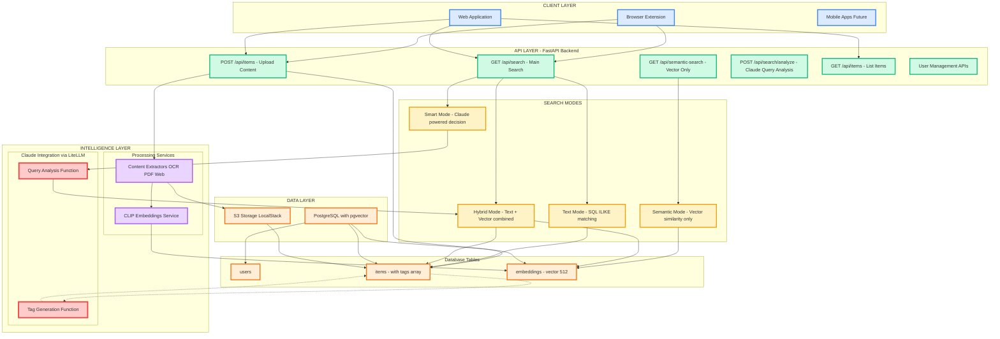

# Synapse

Your intelligent second brain - store, search, and discover content across images, URLs, documents, and notes with AI-powered multimodal search.

the fundamental idea is to create a core service with apis and postgres db and expose those apis to interact with many interfaces (website, browser extension, llm, mobile app)

## Features

- **Multimodal Storage**: Images, URLs, PDFs, videos, notes, products.
- **AI-Powered Search**: Claude analyzes your queries and suggests optimal search strategies
- **Smart Content Types**: Automatic filtering based on what you're looking for
- **Semantic + Text Search**: CLIP embeddings + traditional text matching
- **Browser Extension**: One-click saving with floating UI
- **Auto-Tagging**: Claude generates smart tags for uploaded content in the background so when you upload smth it gets saved instantaneously but the tags are processed in the background and later added for better search.

## Quick Start

### Backend
```bash
cd backend
uv run python main.py
```

### Frontend  
```bash
cd frontend
npm install && npm run dev
```

### Browser Extension
1. Load `browser-extension/` as unpacked extension in Chrome
2. Drag images or click the floating save button

### HLD (high level design)



## Search Modes

- **Smart (Claude AI)**: Claude analyzes your query and chooses the best approach
- **Hybrid**: Combines text matching with semantic similarity  
- **Semantic**: Pure AI similarity search using CLIP embeddings
- **Text**: Traditional keyword matching

## Tech Stack

- **Backend**: FastAPI + PostgreSQL + pgvector
- **Frontend**: React + TypeScript + Vite
- **AI**: Claude + CLIP embeddings
- **Storage**: S3-compatible (LocalStack for dev)

## Environment Setup

Create `backend/.env`:
```
ANTHROPIC_BASE_URL=your_litellm_endpoint
ANTHROPIC_AUTH_TOKEN=your_api_key
DEBUG=true
```

## How It Works

1. **Upload**: Save any content type with automatic CLIP embedding generation
2. **Claude Analysis**: Background tagging and search query optimization  
3. **Smart Search**: Multi-term OR search with intelligent content type filtering
4. **Results**: Ranked by relevance with similarity scores

Built for speed, intelligence, and discovery.
